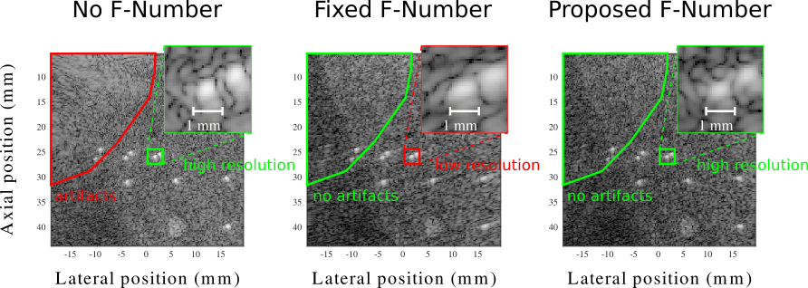
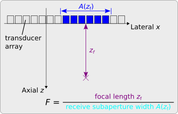

# Frequency-Dependent F-Number for Coherent Plane-Wave Compounding

<!-- shields -->
[![GitHub][license-shield]][license-url]
![GitHub repo size][size-shield]
![GitHub Downloads][downloads-shield]
![Stargazers][stars-shield]
[![View on File Exchange][fex-shield]][fex-url]
[](https://www.youtube.com/watch?v=T6BoYRvQ6rg)

[license-shield]: https://img.shields.io/github/license/mschiffn/f_number
[license-url]: https://github.com/mschiffn/f_number/COPYING
[size-shield]: https://img.shields.io/github/repo-size/mschiffn/f_number
[downloads-shield]: https://img.shields.io/github/downloads/mschiffn/f_number/total
[stars-shield]: https://img.shields.io/github/stars/mschiffn/f_number.svg
[fex-shield]: https://www.mathworks.com/matlabcentral/images/matlab-file-exchange.svg
[fex-url]: https://www.mathworks.com/matlabcentral/fileexchange/99309-frequency-dependent-f-number-for-cpwc

Simple [MATLAB](https://mathworks.com/products/matlab.html) implementation of
the frequency-dependent F-number
[[1]](#SchiffnerIUS2021) for
coherent plane-wave compounding.



## What is an F-Number?

The F-number significantly reduces
image artifacts in
all image formation methods using
the delay-and-sum (DAS) algorithm, such as

- coherent plane-wave compounding [[2]](#MontaldoITUFFC2009), or
- synthetic aperture imaging [[3]](#JensenUlt2006).

The F-number, for
a uniform linear transducer array, equals
the quotient of
the focal length and
the width of
the receive subaperture.



The usage of
a fixed F-number results in
a dynamic receive subaperture whose
width increases with
the focal length.

## Established Methods to Compute the F-Number are Contradictory and Yield Frequency-Dependent Results

Established methods to compute
the optimal F-number attribute
the image artifacts to
two different phenomena:

1. Noise [[4]](#PerrotUlt2021), [[5]](#Szabo2013), [[2]](#MontaldoITUFFC2009):
The directivity of
the array elements attenuates
the echoes and reduces
the signal-to-noise ratio of
the recorded signals.

2. Grating lobes [[6]](#DelannoyJAP1979), [[7]](#BruneelJAP1978):
The width of
the receive subaperture determines
the grating lobe-to-main lobe ratio.

Both approaches, although yielding
similar F-numbers (0.5 <= F <= 2), are
mutually contradictory.

Wide array elements, for example, show
an increased directivity.<br>
The "Noise" approach suggests
the usage of
narrow receive subapertures or, equivalently,
*large* F-numbers for
such elements to improve
the signal-to-noise ratio.<br>
The "Grating lobes" approach, in contrast, permits
wide receive subapertures or, equivalently,
*small* F-numbers for
such elements because they attenuate
the grating lobes.

Both approaches, moreover, yield
F-numbers that increase with
the frequency.

The DAS algorithm, however, requires
a fixed F-number and typically uses
the maximum F-number at
the upper frequency bound.
This F-number satifies
the conditions for
all lower frequencies but, owing to
its suboptimal value, reduces
the spatial resolution.

## What Does the Proposed F-Number Accomplish?

The proposed F-number not only eliminates
image artifacts but also maintains
the spatial resolution of
the full aperture
[[1]](#proc:SchiffnerIUS2021).

This F-number, in particular, prevents
the first-order grating lobes from insonifying
reflective image structures.
The F-number, to
this end, uses
a closed-form expression, which derives from
the far-field sensitivity of
the focused receive subaperture, to impose
a minimum angular distance on
these grating lobes.

## How Does the Implementation Work?

A Fourier-domain beamforming algorithm enables
the usage of
frequency-dependent F-numbers.
The algorithm not only varies
the width of
the receive subaperture with
the voxel position but also with
the frequency.
This additional frequency dependence, in contrast to
a fixed F-number, includes
additional frequency components that improve both
the contrast and
the spatial resolution.

| Method            | Width of the receive subaperture  | Spatial resolution | Grating lobe suppression |
| ----------------- | --------------------------------- | ------------------ | ------------------------ |
| No F-number       | always full                       | optimal            | none                     |
| Fixed F-number    | position-dependent                | minimal            | exaggerated              |
| Proposed F-number | frequency- and position-dependent | almost optimal     | optimal                  |

## Getting Started

1. Clone the repository or download the release to your local hard drive.

```
git clone https://github.com/mschiffn/f_number
```

2. Add the repository to your MATLAB path using .

```matlab
addpath( genpath( './f_number' ) )
```

## Folder Structure

The repository has the following structure:

    .
	├── +auxiliary      # auxiliary functions (e.g., dimension and size check)
    ├── +f_numbers      # classes for various types of F-numbers (e.g., constant, directivity-derived, proposed)
    ├── +windows        # classes for various window functions (e.g., boxcar, Hann, Tukey)
    ├── das_pw.m        # main function
    ├── LICENSE         # license file
    └── README.md       # this readme

The packages +f_numbers and +windows contain
an exemplary class hierarchy to manage
various types of
F-numbers and
window functions.

## Image Formation

Use the function das_pw to form images.

In MATLAB type
```matlab
help das_pw
```

to obtain an explanation of the input and output arguments.

The typical usage is:

```matlab
[ image, F_number_values ] = das_pw( positions_x, positions_z, data_RF, f_s, e_theta, element_width, element_pitch, ( 1 - N_elements ) / 2, [ f_lb, f_ub ], c_ref, N_samples_shift, window, F_number);
```

The proposed F-number can be instantiated by

```matlab
chi_lb = 45;  % minimum angular distance of the first-order grating lobes
F_ub = 3;     % maximum permissible F-number
F_number_rx = f_numbers.grating.angle_lb( chi_lb, F_ub );
```

The directivity-derived F-numbers
[[4]](#PerrotUlt2021),
[[5]](#Szabo2013) are

```matlab
width_over_pitch = 0.918;  % element width-to-element pitch ratio (1)
F_number_rx_1 = f_numbers.directivity.perrot( width_over_pitch );
F_number_rx_2 = f_numbers.directivity.szabo( width_over_pitch );
```

The standard fixed F-number is

```matlab
F_number_rx_3 = f_numbers.constant( 3 );
```

## References :notebook:

1. <a name="SchiffnerIUS2021"></a>
M. F. Schiffner and G. Schmitz,
"Frequency-Dependent F-Number Increases the Contrast and the Spatial Resolution in Fast Pulse-Echo Ultrasound Imaging,"
2021 IEEE Int. Ultrasonics Symp. (IUS), in press.
[](http://arxiv.org/abs/2111.04593)
[](https://www.youtube.com/watch?v=T6BoYRvQ6rg)

2. <a name="MontaldoITUFFC2009"></a>
G. Montaldo, M. Tanter, J. Bercoff, N. Benech, and M. Fink,
“Coherent plane-wave compounding for very high frame rate ultrasonography and transient elastography,"
IEEE Trans. Ultrason., Ferroelectr., Freq. Control, vol. 56, no. 3, pp. 489–506, Mar. 2009.
[](http://dx.doi.org/10.1109/TUFFC.2009.1067)

3. <a name="JensenUlt2006"></a>
J. A. Jensen, S. I. Nikolov, K. L. Gammelmark, and M. H. Pedersen,
“Synthetic aperture ultrasound imaging,” Ultrasonics, vol. 44, Supplement, e5–e15, Dec. 2006.
[](http://dx.doi.org/10.1016/j.ultras.2006.07.017)

4. <a name="PerrotUlt2021"></a>
V. Perrot, M. Polichetti, F. Varray, and D. Garcia,
“So you think you can DAS? A viewpoint on delay-and-sum beamforming,”
Ultrasonics, vol. 111, p. 106 309, Mar. 2021.
[](http://dx.doi.org/10.1016/j.ultras.2020.106309)

5. <a name="Szabo2013"></a>
T. L. Szabo, Diagnostic Ultrasound Imaging: Inside Out, 2nd. Elsevier Academic Press, Dec. 2013

6. <a name="DelannoyJAP1979"></a>
B. Delannoy, R. Torguet, C. Bruneel, E. Bridoux, J. M. Rouvaen, and H. Lasota,
“Acoustical image reconstruction in parallel-processing analog electronic systems,”
J. Appl. Phys., vol. 50, no. 5, pp. 3153–3159, May 1979.
[](http://dx.doi.org/10.1063/1.326397)

7. <a name="BruneelJAP1978"></a>
C. Bruneel, E. Bridoux, B. Delannoy, B. Nongaillard, J. M. Rouvaen, and R. Torguet,
“Effect of spatial sampling on an acoustical image reconstruction,”
J. Appl. Phys., vol. 49, no. 2, pp. 569–573, Feb. 1978.
[](http://dx.doi.org/10.1063/1.324680)
